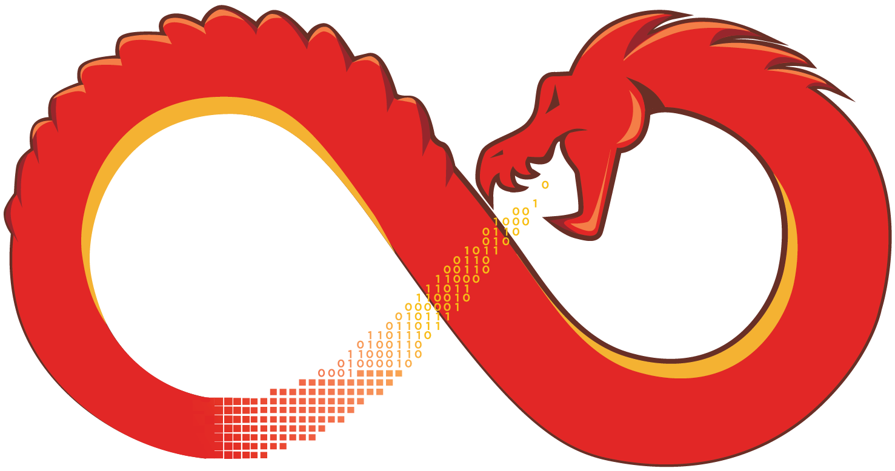

[](https://pepy.tech/project/unicorn)
[](https://bugs.chromium.org/p/oss-fuzz/issues/list?sort=-opened&can=1&q=proj:unicorn)

<p align="center">
    <picture>
        <source media="(prefers-color-scheme: dark)" srcset="Ghidra/Features/Base/src/main/resources/images/GHIDRA_2.png">
        
    </picture>
</p>

<div align="center">
<h2>National Security Agency</h2>
Ghidra is a Software Reverse Engineering
<p></div>

<p align="center">
  <a href="#ghidra">About</a> •
  <a href="#the-expand-update">Update</a> •
  <a href="#developer">NSA</a>
</p>

# Ghidra 

Ghidra is a software reverse engineering (SRE) framework created and maintained by the 
[National Security Agency][nsa] Research Directorate. This framework includes a suite of 
full-featured, high-end software analysis tools that enable users to analyze compiled code on a 
variety of platforms including Windows, macOS, and Linux. Capabilities include disassembly, 
assembly, decompilation, graphing, and scripting, along with hundreds of other features. Ghidra 
supports a wide variety of processor instruction sets and executable formats and can be run in both 
user-interactive and automated modes. Users may also develop their own Ghidra extension components 
and/or scripts using Java or Python.

In support of NSA's Cybersecurity mission, Ghidra was built to solve scaling and teaming problems 
on complex SRE efforts, and to provide a customizable and extensible SRE research platform. NSA has 
applied Ghidra SRE capabilities to a variety of problems that involve analyzing malicious code and 
generating deep insights for SRE analysts who seek a better understanding of potential 
vulnerabilities in networks and systems.

## The `Expand` Update

ghidra is a complete rewrite of radare. It provides a set of libraries, tools and
plugins to ease reverse engineering tasks. Distributed mostly under LGPLv3, and Apache 2.0 each plugin can have different licenses (see ghidra -L, rasm2 -L, ...).

The radare project started as a simple command-line hexadecimal editor focused
on forensics. Today, ghidra is a featureful low-level command-line tool with
support for scripting with the embedded Javascript interpreter or via ghidrapipe.

ghidra can edit files on local hard drives, view kernel memory, and debug programs
locally or via a remote gdb or windbg servers. ghidra's wide architecture support allows
you to analyze, emulate, debug, modify, and disassemble any binary.

If you are a U.S. citizen interested in projects like this, to develop Ghidra and other 
cybersecurity tools for NSA to help protect our nation and its allies, consider applying for a 
[career with us][career].

## Security Warning

**WARNING:** There are known security vulnerabilities within certain versions of Ghidra. Before 
proceeding, please read through Ghidra's [Security Advisories][security] for a better understanding 
of how you might be impacted.

## Install
To install an official pre-built multi-platform Ghidra release:  
* Install [JDK 21 64-bit][jdk]
* Download a Ghidra [release file][releases]
  - **NOTE:** The official multi-platform release file is named 
    `ghidra_<version>_<release>_<date>.zip` which can be found under the "Assets" drop-down.
    Downloading either of the files named "Source Code" is not correct for this step.
* Extract the Ghidra release file
* Launch Ghidra: `./ghidraRun` (or `ghidraRun.bat` for Windows)

For additional information and troubleshooting tips about installing and running a Ghidra release, 
please refer to the [Installation Guide][installationguide] which can be found in a Ghidra release
at `docs/InstallationGuide.html`. 

## Build

To create the latest development build for your platform from this source repository:

##### Install build tools:
* [JDK 21 64-bit][jdk]
* [Gradle 8.5+][gradle] (or provided Gradle wrapper if Internet connection is available)
* [Python3][python3] (version 3.9 to 3.13) with bundled pip
* make, gcc, and g++ (Linux or macOS-only)
* [Microsoft Visual Studio][vs] 2017+ or [Microsoft C++ Build Tools][vcbuildtools] with the
  following components installed (Windows-only):
  - MSVC
  - Windows SDK
  - C++ ATL

##### Download and extract the source:
[Download from GitHub][master]
```
unzip ghidra-master
cd ghidra-master
```
**NOTE:** Instead of downloading the compressed source, you may instead want to clone the GitHub repository: 

```
git clone https://github.com/byt3n33dl3/ghidra.git
```

##### Download additional build dependencies into source repository:
**NOTE:** If an Internet connection is available and you did not install Gradle, the following 
`gradle` commands may be replaced with `./gradle(.bat)`.
```
gradle -I gradle/support/fetchDependencies.gradle
```

##### Create development build: 
```
gradle buildGhidra
```
The compressed development build will be located at `build/dist/`.

For more detailed information on building Ghidra, please read the [Developer Guide][devguide].

For issues building, please check the [Known Issues][known-issues] section for possible solutions.

## Developer

### User Scripts and Extensions
Ghidra installations support users writing custom scripts and extensions via the *GhidraDev* plugin 
for Eclipse.  The plugin and its corresponding instructions can be found within a Ghidra release at
`Extensions/Eclipse/GhidraDev/` or at [this link][ghidradev].  Alternatively, Visual Studio Code may
be used to edit scripts by clicking the Visual Studio Code icon in the Script Manager.
Fully-featured Visual Studio Code projects can be created from a Ghidra CodeBrowser window at 
_Tools and Create VSCode Module project_.

**NOTE:** Both the *GhidraDev* plugin for Eclipse and Visual Studio Code integrations only support 
developing against fully built Ghidra installations which can be downloaded from the
[Releases][releases] page.

### Advanced Development
To develop the Ghidra tool itself, it is highly recommended to use Eclipse, which the Ghidra 
development process has been highly customized for.

##### Install build and development tools:
* Follow the above [build instructions](#build) so the build completes without errors
* Install [Eclipse IDE for Java Developers][eclipse]

##### Prepare the development environment:
``` 
gradle prepdev eclipse buildNatives
```

##### Import Ghidra projects into Eclipse:
* *File* to *Import...*
* *General Existing Projects into Workspace*
* Select root directory to be your downloaded or cloned ghidra source repository
* Check *Search for nested projects*
* Click *Finish*

When Eclipse finishes building the projects, Ghidra can be launched and debugged with the provided
**Ghidra** Eclipse *run configuration*.

For more detailed information on developing Ghidra, please read the [Developer Guide][devguide]. 

## Popular Plugins:

Using the `ghidrapm` tool you can browse and install many plugins and tools that use radare2.

* [esilsolve](https://github.com/radareorg/esilsolve): The symbolic execution plugin, based on esil and z3
* [iaito](https://github.com/radareorg/iaito): The official Qt graphical interface
* [keystone](https://github.com/radareorg/radare2-extras/tree/master/keystone) Assembler instructions using the Keystone library
* [decai](https://github.com/radareorg/ghidraai) Decompiler based on AI
* [ghidraai](https://github.com/radareorg/ghidraai) Run a Language Model in localhost with Llama inside ghidra!
* [ghidradec](https://github.com/wargio/ghidradec-js): A decompiler based on ghidra written in JS, accessed with the `pdd` command
* [ghidradiaphora](https://github.com/FernandoDoming/ghidradiaphora): [Diaphora](https://github.com/joxeankoret/diaphora)'s binary diffing engine on top of radare2
* [ghidrafrida](https://github.com/nowsecure/ghidrafrida): The frida io plugin. Start ghidra with `ghidra frida://0` to use it
* [ghidraghidra](https://github.com/radareorg/ghidraghidra): The standalone native ghidra decompiler accessible with `pdg`
* [ghidrapapi](https://github.com/radareorg/radare2-ghidrapapi) High level api on top of ghidrapipe
* [ghidrapipe](https://github.com/radareorg/radare2-ghidrapipe) Script radare2 from any programming language
* [ghidrapoke](https://github.com/radareorg/radare2-extras/tree/master/ghidrapoke) Integration with GNU/Poke for extended binary parsing capabilities
* [goresym](https://github.com/hanemile/radare2-GoReSym): Import GoReSym symbol as flags
* [ghidrayara](https://github.com/radareorg/ghidrayara) Run Yara from ghidra or use ghidra primitives from Yara
* [radius2](https://github.com/nowsecure/radius2): A fast symbolic execution engine based on boolector and esil
* [ghidrasarif](https://github.com/radareorg/ghidrasarif) import, extend, export SARIF documents

## Operating Systems

Windows (since XP), Linux, Darwin, GNU/Hurd, Apple's such as: Mac, i, iPad, watch, iOS, Android, Wasmer,
[Dragonfly, Net, Free, Open] BSD, Z/OS, QNX, SerenityOS, Solaris, AIX, Haiku, Vinix, FirefoxOS.

## Architectures

i386, x86-64, Alpha, ARM, AVR, BPF, MIPS, PowerPC, SPARC, RISC-V, SH, m68k,
S390, XCore, CR16, HPPA, ARC, Blackfin, Z80, H8/300, V810, PDP11, m680x, V850,
CRIS, XAP (CSR), PIC, LM32, 8051, 6502, i4004, i8080, Propeller, EVM, OR1K
Tricore, CHIP-8, LH5801, T8200, GameBoy, SNES, SPC700, MSP430, Xtensa, xcore,
NIOS II, Java, Dalvik, Pickle, WebAssembly, MSIL, EBC, TMS320 (c54x, c55x,
c55+, c64x), Hexagon, Brainfuck, Malbolge, whitespace, DCPU16, LANAI, lm32,
MCORE, mcs96, RSP, SuperH-4, VAX, KVX, Am29000, LOONGARCH, JDH8, s390x, STM8.

## File Formats

ELF, Mach-O, Fatmach-O, PE, PE+, MZ, COFF, XCOFF, OMF, TE, XBE, SEP64, BIOS or UEFI, 
Dyldcache, DEX, ART, Java class, Android boot image, Plan9 executables, Amiga HUNK,
ZIMG, MBN/SBL bootloader, ELF coredump, MDMP (Windows minidump), PDP11, XTAC, CGC,
WASM (WebAssembly binary), Commodore VICE emulator, QNX, WAD, OFF, TIC-80,
GB/GBA, NDS and N3DS, and mount several filesystems like NTFS, FAT, HFS+, EXT.

<p align="center">
    <picture>
        <source media="(prefers-color-scheme: dark)" srcset="Ghidra/Features/Base/src/main/resources/images/Seal_of_the_U.S._National_Security_Agency.svg">
        
    </picture>
</p>

<div align="center">
<h2>National Security Agency</h2>
Ghidra Contributors and Story
<p></div>

## Contribute
If you would like to contribute bug fixes, improvements, and new features back to Ghidra, please 
take a look at our [Contributor Guide][contrib] to see how you can participate in this open 
source project.

[nsa]: https://www.nsa.gov
[contrib]: CONTRIBUTING.md
[devguide]: DevGuide.md
[installationguide]: GhidraDocs/InstallationGuide.md
[known-issues]: DevGuide.md#known-issues
[career]: https://www.intelligencecareers.gov/nsa
[releases]: https://github.com/byt3n33dl3/ghidra/releases
[jdk]: https://adoptium.net/temurin/releases
[gradle]: https://gradle.org/releases/
[python3]: https://www.python.org/downloads/
[vs]: https://visualstudio.microsoft.com/vs/community/
[vcbuildtools]: https://visualstudio.microsoft.com/visual-cpp-build-tools/
[eclipse]: https://www.eclipse.org/downloads/packages/
[master]: https://github.com/byt3n33dl3/ghidra/archive/refs/heads/master.zip
[security]: https://github.com/byt3n33dl3/ghidra/security/advisories
[ghidradev]: GhidraBuild/EclipsePlugins/GhidraDev/GhidraDevPlugin/README.md

# Ghidra Contributors

Virtual hug to everyone who Contributed, moreover the rest of the team was Under National Security Agency account.

<a href="https://github.com/byt3n33dl3/thc-Ghidra/graphs/contributors">
  
</a>